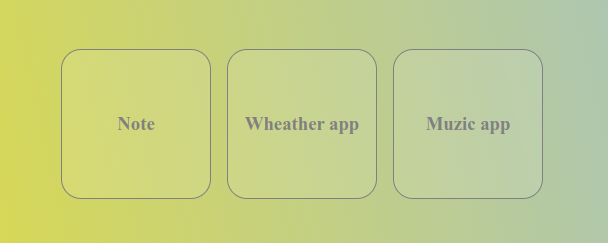
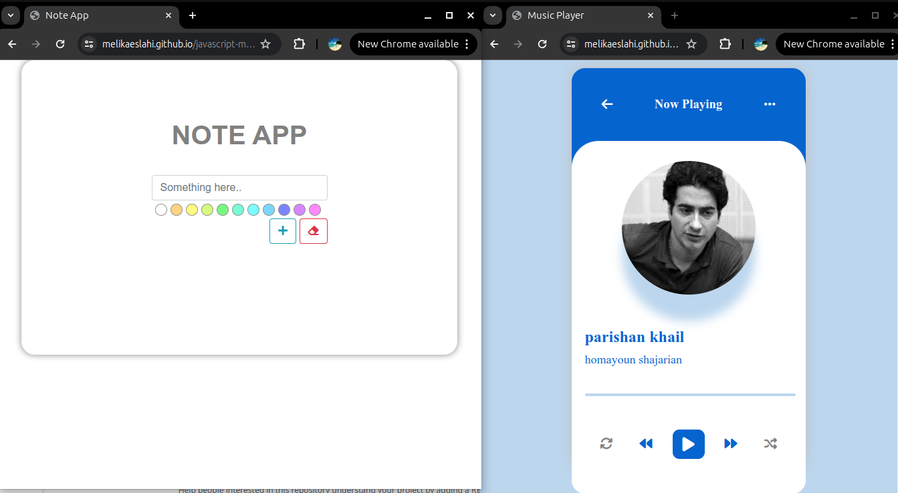
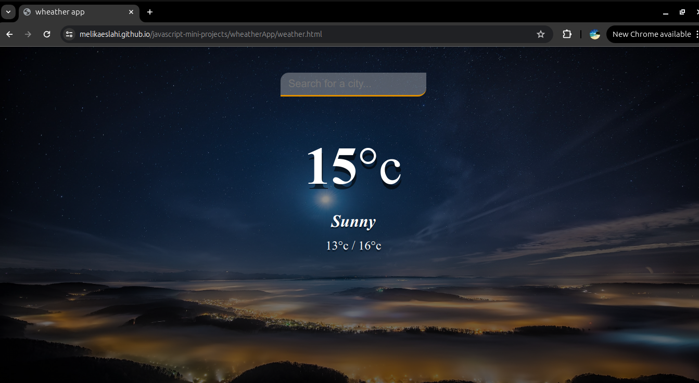

# 📚 JavaScript Mini Projects

A collection of small and practical mini-projects built with vanilla JavaScript, HTML, and CSS. These projects are designed for practice, learning fundamental concepts, and showcasing front-end development skills.

## 💡 Technologies Used

- ✅ HTML5
- 🎨 CSS3
- 🧠 JavaScript (ES6+)
- 📦 No frameworks or libraries used

## Live Demo
Home | [Live](https://melikaeslahi.github.io/javascript-mini-projects/)

## 📸 Screenshots

  
  
  

## 🔮 Future Ideas
Dark mode toggle for all projects

Responsive layout for small screens

Deploy each project separately

## 📄 License
This repository is licensed under the MIT License.

